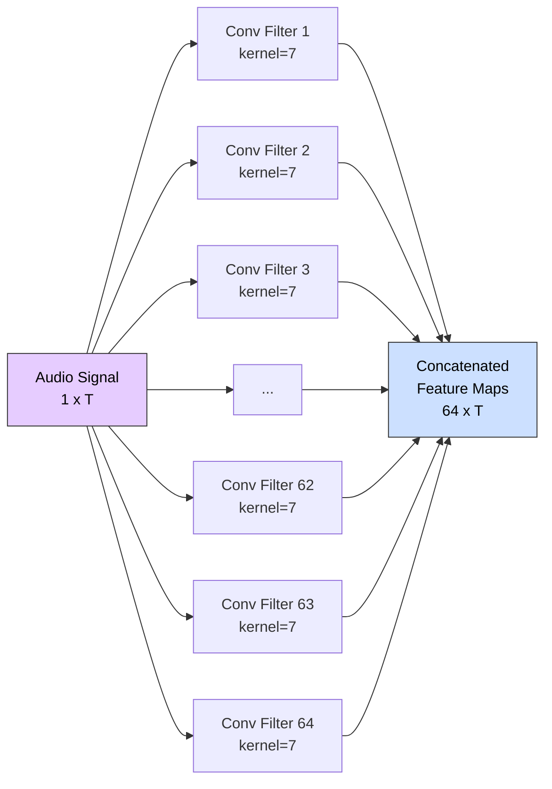

# Audio Preprocessing Pipeline

## Initial Convolution Mapping as Parallel Filters

```mermaid
graph LR
    A[Audio Signal<br>1 x T] --> B1[Conv Filter 1<br>kernel=7]
    A --> B2[Conv Filter 2<br>kernel=7]
    A --> B3[Conv Filter 3<br>kernel=7]
    A --> D[...]
    A --> B62[Conv Filter 62<br>kernel=7]
    A --> B63[Conv Filter 63<br>kernel=7]
    A --> B64[Conv Filter 64<br>kernel=7]
    
    B1 --> C[Concatenated<br>Feature Maps<br>64 x T]
    B2 --> C
    B3 --> C
    D --> C
    B62 --> C
    B63 --> C
    B64 --> C

    style A fill:#e6ccff,stroke:#333,color:#000
    style C fill:#cce0ff,stroke:#333,color:#000
```
