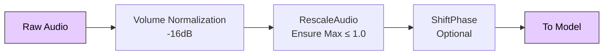
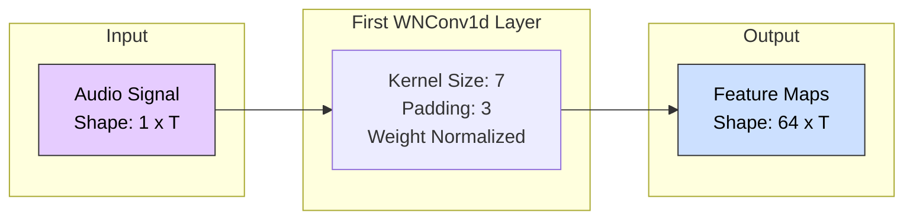

# Audio Preprocessing Pipeline

## Volume Normalization and Processing

```mermaid
graph LR
    A[Raw Audio] --> B[Volume Normalization<br>-16dB]
    B --> C[RescaleAudio<br>Ensure Max ≤ 1.0]
    C --> D[ShiftPhase<br>Optional]
    D --> E[To Model]

    style A fill:#e6ccff,stroke:#333,color:#000
    style E fill:#e6ccff,stroke:#333,color:#000
```

## Initial Convolution Mapping

```mermaid
graph LR
    subgraph Input
        A[Audio Signal<br>Shape: 1 x T] 
    end

    subgraph "First WNConv1d Layer"
        B[Kernel Size: 7<br>Padding: 3<br>Weight Normalized]
    end

    subgraph Output
        C[Feature Maps<br>Shape: 64 x T]
    end

    A --> B --> C

    style A fill:#e6ccff,stroke:#333,color:#000
    style C fill:#cce0ff,stroke:#333,color:#000
```
