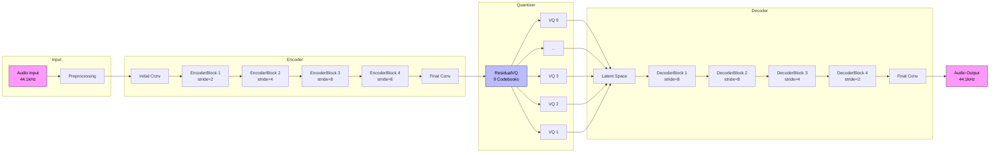

```mermaid
%% By Claude in Cursor 2024-12-07
graph LR
    subgraph Input
        A[Audio Input<br>44.1kHz] --> B[Preprocessing]
        style A fill:#e6ccff,stroke:#333,color:#000
    end

    subgraph Encoder
        B --> C[Initial Conv]
        C --> D[EncoderBlock 1<br>stride=2]
        D --> E[EncoderBlock 2<br>stride=4]
        E --> F[EncoderBlock 3<br>stride=8]
        F --> G[EncoderBlock 4<br>stride=8]
        G --> H[Final Conv]
    end

    subgraph Quantizer
        H --> I[ResidualVQ<br>9 Codebooks]
        I --> J[VQ 1]
        I --> K[VQ 2]
        I --> L[VQ 3]
        I --> M[...]
        I --> N[VQ 9]
        style I fill:#e6ccff,stroke:#333,color:#000
    end

    subgraph Decoder
        O[Latent Space] --> P[DecoderBlock 1<br>stride=8]
        P --> Q[DecoderBlock 2<br>stride=8]
        Q --> R[DecoderBlock 3<br>stride=4]
        R --> S[DecoderBlock 4<br>stride=2]
        S --> T[Final Conv]
    end

    N --> O
    M --> O
    L --> O
    K --> O
    J --> O
    
    T --> U[Audio Output<br>44.1kHz]
    style U fill:#e6ccff,stroke:#333,color:#000

    style A fill:#f9f,stroke:#333
    style U fill:#f9f,stroke:#333
    style I fill:#bbf,stroke:#333
``` 
